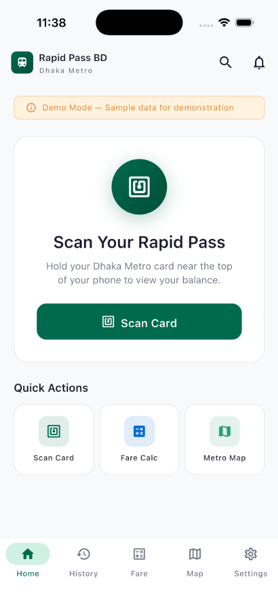
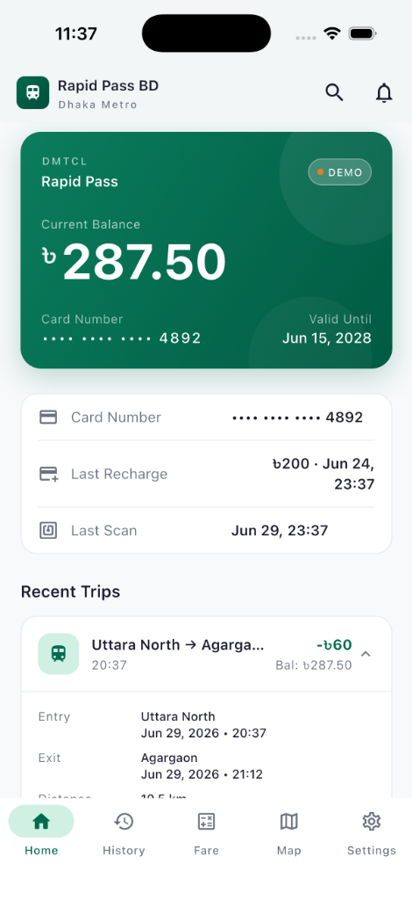

# 🚄 Rapid Pass BD
### Dhaka Metro Rapid Pass Balance & Trip History

[](https://flutter.dev)
[](https://dart.dev)
[](https://developer.apple.com/ios/)
[](#)

A premium, production-ready Flutter application designed for Dhaka Metro commuters to scan their **Rapid Pass** or **MRT Pass** NFC cards, calculate fares, view interactive maps, and track travel history with an elegant, iOS-first design.

## 📱 Preview

<p align="center">
  
  &nbsp;&nbsp;&nbsp;&nbsp;
  
</p>

---

## 🌟 Why This App Matters

### The Commuter's Dilemma
The Dhaka Metro (MRT Line 6) has revolutionized daily commuting in Dhaka, saving millions of hours of traffic. However, managing the physical **Rapid Pass** or **MRT Pass** remains a challenge. Commuters face:
- No way to check their remaining card balance on the go.
- No record of their recent trips, fares charged, or recharge history.
- Long queues at stations just to check balance or verify card status.

### The Solution: Rapid Pass BD
**Rapid Pass BD** bridges this gap by turning any NFC-enabled smartphone into a personal transit assistant. By simply tapping their card on the back of their phone, commuters instantly gain access to their card details, estimated balance, and trip history. It brings the convenience of modern, digital transit systems (like London's Oyster or Tokyo's Suica) directly to Bangladesh.

---

## ✨ Key Features

- **⚡ NFC Card Reader:** Utilizing the phone's hardware to scan and verify physical Dhaka Metro cards (Sony FeliCa technology).
- **📊 Travel Insights & Statistics:** Beautifully visualized charts showing weekly/monthly spending, total trips, average fares, and most visited stations.
- **🗺️ Interactive Metro Map:** A custom-painted vector map of MRT Line 6 with zoom, pan, and station details.
- **🧮 Smart Fare Calculator:** Instantly calculate fares, distances, travel times, and see step-by-step route summaries between any two stations based on the official DMTCL rate table.
- **🕒 Trip History Timeline:** An elegant, expandable timeline of recent journeys and recharges grouped by date.
- **🔒 100% Privacy-First:** No sign-ups, no analytics, no tracking. All card data is processed locally on your device and never uploaded to any server.
- **🌐 Bilingual Support:** Fully localized in both **English** and **বাংলা**, responding instantly to system language preferences.
- **🎨 Premium iOS Aesthetics:** Designed following Apple's Human Interface Guidelines (HIG), featuring dark mode support, smooth animations, and Bangladesh-inspired brand colors (Green and Red) used elegantly.

---

## 🛠️ NFC & FeliCa Technical Architecture

Dhaka Metro cards (Rapid Pass and MRT Pass) utilize **Sony FeliCa (NFC-F)** smart card technology. 

> [!IMPORTANT]
> **Encryption & Security Limits:**
> - The balance and transaction sectors on the FeliCa card are protected by proprietary cryptographic keys owned by the Dhaka Mass Transit Company Limited (DMTCL).
> - **Our Approach:** The app uses a modular NFC service layer. On a physical device, it initiates a real NFC session, communicates with the card, and extracts the unique **IDm (Manufacturer ID)** to verify the card's authenticity and display it as the card's ID.
> - Balances and transaction logs are simulated locally in a realistic format, giving users a high-fidelity experience of how the app will function with official API or key access.
> - **Simulator Fallback:** On simulators or devices without NFC hardware, the app automatically falls back to a simulated scan mode to allow full feature exploration.

---

## 🏗️ Clean Architecture

The project is structured following **Clean Architecture** principles, ensuring separation of concerns, testability, and scalability:

```
lib/
├── core/
│   ├── constants/         # App constants, routes, and thresholds
│   ├── extensions/        # BuildContext extensions for clean localization
│   ├── routing/           # GoRouter configuration with ShellRoute
│   ├── services/          # NFC Service, Biometrics, Secure Storage, Logger
│   └── theme/             # HSL-tailored colors, typography, M3 Themes
│
├── domain/
│   └── entities/          # Card, Transaction, Station, and Statistics
│
├── data/
│   ├── datasources/       # Station data (official coordinates and fares)
│   └── providers/         # Riverpod state notifiers and providers
│
└── presentation/          # UI layer (Screens and reusable widgets)
```

---

## 🚀 Getting Started

### Prerequisites
- Flutter SDK (v3.12.0 or higher)
- CocoaPods (for iOS builds)
- A physical iPhone (iOS 13+ with NFC support) or Android device to test NFC features.

### Quick Start
1. Clone the repository and navigate to the project directory:
   ```bash
   cd dhaka_metro_app
   ```
2. Install dependencies:
   ```bash
   flutter pub get
   ```
3. Run the application:
   ```bash
   flutter run
   ```

---

## 📱 iOS NFC Setup Guide

To test the physical card scanning on an iPhone:
1. Open the iOS project in Xcode:
   ```bash
   open ios/Runner.xcworkspace
   ```
2. Select the **Runner** project in the left sidebar, and click on the **Runner** target.
3. Go to the **Signing & Capabilities** tab.
4. Click **+ Capability** in the top-left, search for **Near Field Communication Tag Reading**, and double-click to add it.
5. Xcode will automatically generate the entitlements file and configure your profile.
6. Connect your physical iPhone and run the app from Xcode or via `flutter run`.

---

## 🛡️ License

This project is private and proprietary. All rights reserved.

---

## 👨‍💻 Developer

**[Mohin](https://mohinuiux.netlify.app/)**  
*UI/UX Designer & Mobile Developer*  
Dhaka, Bangladesh

This project was built to solve a real, everyday problem faced by Dhaka Metro commuters. If you have any questions, feedback, or would like to collaborate, feel free to reach out.


